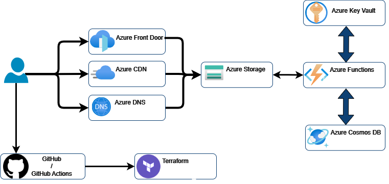

# Federico Mencuccini's Azure Resume

This is my Cloud Resume Challenge built on Azure. It's a static website hosted on Azure Storage, with a visitor counter built on Azure Functions. The website is built with HTML, CSS, and JavaScript. The visitor counter is built with .NET and Azure Functions. 

## Demo

[View it live here](https://resumestoragefreddy.z13.web.core.windows.net/)

## Full Documentation

I have documented every step of this project, detailing the challenges encountered and explaining the utility of each service. 

Additionally, I provide an overview of the tools used, such as GitHub and Terraform, along with a guide on how to utilize them to create a project on your own

[Full project documentation Here](https://www.dropbox.com/home/Federico%20Mencuccini/Aplicaciones/Cloud%20Projects/Docx%20and%20Cloud%20Stuff/Documentations?select=ResumeAzure_Documentation.pdf)

## Useful Git Commands

 * rm -rf .git (Remove .GIT folder in case project not working correctly)
 * git add .
 * git add -A
 * git commit -m "Updated Structure"
 * git push origin main

## Structure

- `frontend/`: Folder contains the website.
    - `main.js`: Javascript file which gets the counter from the Function
    - `index.html`: **HTML File Displaying Counter from `Main.js`**
- `backend/api`: Folder contains the dotnet API deployed on Azure Functions.
    - `Counter.cs`: Contains the visitor counter code.
    - `GetVisitorCounter.cs`: Gets the counter number from the Cosmos DB
    - `IVisitorCounterService.cs`: Counter incrementer
- `.github/workflows/`: Folder contains **CI/CD workflow configurations** for the Frontend and Backend
- `terraform`: Folder containing the infrastructure created with Terraform (IaC) using *Azure PaaS Services*
    - `AZ-104 Oriented`: To align with my goal of becoming a **Cloud Administrator**, I modified specific services to utilize IaaS-based solutions.

## Frontend resources

The front-end is a static site with HTML, CSS, and JavaScript. It's static and has a visitor counter. The visitor counter data fetched via an API call to an Azure Function.

- Here's the [HTML template](https://shorturl.at/NxjRL) I created for you to freely use and download:

- If you do not like my template, I have left a more [modern template](https://www.styleshout.com/free-templates/ceevee/)

- [Azure storage explorer](https://azure.microsoft.com/en-us/features/storage-explorer/) is a handy tool to use when working with Storage Accounts

- This is how you can [deploy static site to blob storage.](https://docs.microsoft.com/en-us/azure/storage/blobs/storage-blob-static-website-host)

## Backend resources

The back-end is an [HTTP triggered Azure Functions](https://docs.microsoft.com/en-us/azure/azure-functions/functions-bindings-http-webhook-trigger?tabs=csharp) with Cosmos DB input and output binding. The Function is triggered, it retrieves the CosmosDB item, adds 1 to it, and saves it and returns its value to the caller.

- [Create a Cosmos DB account](https://docs.microsoft.com/en-us/azure/cosmos-db/create-cosmosdb-resources-portal)
- [Create an HTTP triggered Azure Function in Visual Studio Code.](https://docs.microsoft.com/azure/azure-functions/functions-develop-vs-code?tabs=csharp)
- [Azure Functions Cosmos DB bindings](https://docs.microsoft.com/en-us/azure/azure-functions/functions-bindings-cosmosdb-v2)
- [Retrieve a Cosmos DB item with Functions binding.](https://docs.microsoft.com/azure/azure-functions/functions-bindings-cosmosdb-v2-input?tabs=csharp)
- [Write to a Cosmos DB item with Functions binding.](https://docs.microsoft.com/azure/azure-functions/functions-bindings-cosmosdb-v2-output?tabs=csharp)
- You'll have to [enable CORS with Azure Functions locally](https://learn.microsoft.com/azure/azure-functions/functions-develop-local#local-settings-file) and once it's [deployed to Azure](https://docs.microsoft.com/azure/azure-functions/functions-how-to-use-azure-function-app-settings?tabs=portal#cors) for you website to be able to call it.

## CI/CD Resources

- This is how you can deploy a blob storage static site with [GitHub actions.](https://docs.microsoft.com/azure/storage/blobs/storage-blobs-static-site-github-actions)
- This is how you can [deploy an Azure Function to Azure with GitHub Actions.](https://github.com/marketplace/actions/azure-functions-action)
- [Implement .NET testing in GitHub Actions.](https://docs.github.com/en/actions/guides/building-and-testing-net)

